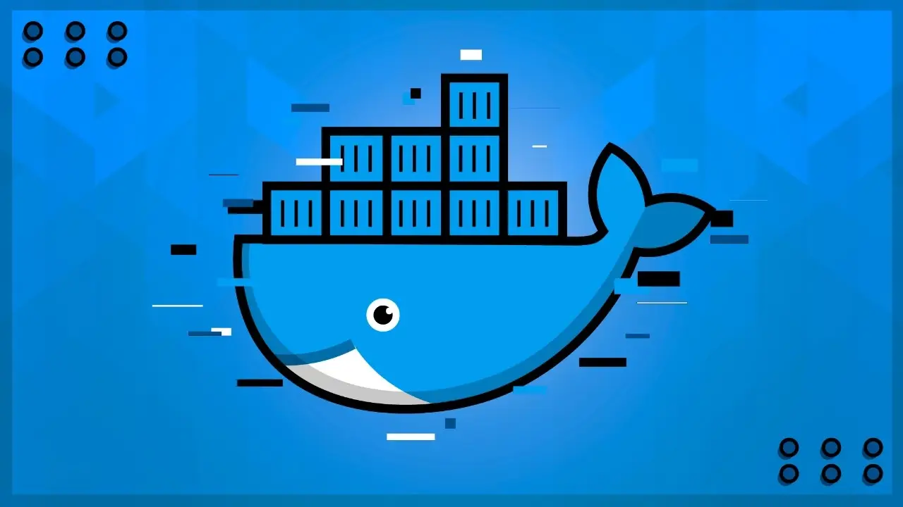

<p align="center">
  <a href="https://www.cod3r.com.br/courses/docker" rel="noopener">
 </a>
</p>

<h3 align="center">Docker: Ferramenta essencial para Desenvolvedores</h3>

<div align="center">

[](/LICENSE)

</div>

---

<p align="center">
  <a href="https://www.cod3r.com.br" rel="noopener">
 </a>
</p>


## 📝 Table of Contents

- [About](#about)
- [Getting Started](#getting_started)
- [Deployment](#deployment)
- [Usage](#usage)
- [Built Using](#built_using)
- [TODO](../TODO.md)
- [Contributing](../CONTRIBUTING.md)
- [Authors](#authors)
- [Acknowledgments](#acknowledgement)
- [Histórico de comandos](#historico_comandos)

## 🧐 About <a name = "about"></a>

### Confira algumas coisas que você aprenderá durante o curso.

- Utilizar containers para simplificar seus processos
- Publicar suas imagens em ambientes na nuvem, seja para distribuição ou execução dos serviços
- Criar imagens com seus produtos
- Gerenciar conjuntos de micro serviços

## 🏁 Getting Started <a name = "getting_started"></a>

These instructions will get you a copy of the project up and running on your local machine for development and testing purposes. See [deployment](#deployment) for notes on how to deploy the project on a live system.

### Prerequisites

What things you need to install the software and how to install them.

```
Give examples
```

### Installing

A step by step series of examples that tell you how to get a development env running.

Say what the step will be

```
Give the example
```

And repeat

```
until finished
```

End with an example of getting some data out of the system or using it for a little demo.

## 🔧 Running the tests <a name = "tests"></a>

Explain how to run the automated tests for this system.

### Break down into end to end tests

Explain what these tests test and why

```
Give an example
```

### And coding style tests

Explain what these tests test and why

```
Give an example
```

## 🎈 Usage <a name="usage"></a>

Add notes about how to use the system.

## 🚀 Deployment <a name = "deployment"></a>

Add additional notes about how to deploy this on a live system.

## ⛏️ Built Using <a name = "built_using"></a>

- [Docker](https://www.docker.com/) - Container

## ✍️ Authors <a name = "authors"></a>

- [@FabianoFPS](https://github.com/FabianoFPS)

See also the list of [contributors](https://github.com/kylelobo/The-Documentation-Compendium/contributors) who participated in this project.

## 🎉 Acknowledgements <a name = "acknowledgement"></a>

- Hat tip to anyone whose code was used
- Inspiration
- References

## Histórico de comandos <a name = "historico_comandos"></a>

```bash

# Testa se o Docker está funcionando corretamente, executando a imagem hello-world
docker container run hello-world

# Demostra uma possivel diferença entre o host e o container
bash --version
docker container run debian bash --version

# Containers em execução
docker container ps

# Todos os containers
docker container ps -a

# Executa e remove
# --rm remove um container
docker run --rm debian bash --version

# Metodo run sempre cria um novo container
# -i modo interativo
# -t acesso ao terminal
docker run -it debian bash
touch arquivo_criado.txt
ls
exit
docker run -it debian bash
ls

# --name especifica o nome do container 
docker run --name mydeb -it debian bash

# Lista Container em execução
docker container ls

# Liesta todos os Containers
docker container ls -a

# excuta o container em modo interativo pelo nome
docker start -ai mydeb

# -p porta_exposta:porta_interna
docker run -p 8080:80 nginx

# -v pasta_local:pasta_container
docker run -p 8080:80 -v $(pwd)/not-found:/usr/share/nginx/html  nginx
docker run -p 8080:80 -v $(pwd)/html:/usr/share/nginx/html  nginx

# -d deamom
docker run -d --name ex-daemon-basic -p 8080:80 -v $(pwd)/html:/usr/share/nginx/html nginx
docker stop ex-daemon-basic
docker start ex-daemon-basic
docker restart ex-daemon-basic
docker stop 4ed0223e8809

# lista cointainers
docker ps
docker container ls
docker container list

# logs
docker container logs ex-daemon-basic

# informações do container
docker container inspect ex-daemon-basic

# exec executa um comando no container
docker container exec ex-daemon-basic uname -or

# listando
docker container ls
docker image ls
docker volume ls

# comandos antigos
# rm remove container
# rmi remove image
docker rm idxxxxx
docker rmi idxxxxx

# remove container
docker container rm 2d9a61655ac0 

# remove image
docker image rm d1165f221234

# helps
docker container --help
docker image --help 
docker volume --help

# baixa imagem
docker image pull redis:latest

#inspeciona
docker image inspect redis

# cria nova tag para uma imgem
docker image tag redis:latest cod3r-redis

# cria image build
# it tag
docker image build -t ex-simple-buid .

# Image com argumentos
docker build -t ex-build-arg ./build-com-arg
docker image ls
docker container run ex-build-arg bash -c 'echo $S3_BUCKET'
docker image build --build-arg S3_BUCKET=myapp -t ex-build-arg ./build-com-arg
docker image inspect --format="{{index .Config.Labels \"maintainer\"}}" ex-build-arg

# Copiando arquivos
docker image build -t ex-build-copy ./build-com-copy
docker container run -p 80:80 ex-build-copy

# Criando e compartilhando volumes
docker image build -t ex-build-dev ./build-dev
docker container run -it -v $(pwd)/build-dev:/app -p 80:8000 --name python-server ex-build-dev
docker container run -it --volumes-from=python-server debian cat /log/http-server.log

# upload Docker hub
docker image tag ex-build-copy fabianofps/ex-cod3r:1.0
docker login --username=fabianofps
docker image push fabianofps/ex-cod3r:1.0

# Redes
docker network ls

# Sem rede
docker container run -d --net none debian
docker container run --rm alpine ash -c "ifconfig"
docker container run --rm --net none alpine ash -c "ifconfig"

# rede Bridge
docker network ls
docker network inspect bridge

docker container run -d --name container1 alpine sleep 1000
docker container exec -it container1 ifconfig

docker container run -d --name container2 alpine sleep 1000
docker container exec -it container2 ifconfig

docker container exec -it container1 ping 172.17.0.3
docker container exec -it container1 ping www.google.com

#Criando nova rede
docker network create --driver bridge rede_nova
docker network ls
docker network inspect rede_nova

docker container run -d --name container3 --net rede_nova alpine sleep 1000
docker container exec -it container3 ifconfig
docker container exec -it container3 ping 172.17.0.2

# Conecta redes diferentes
docker network connect bridge container3
docker container exec -it container3 ifconfig
docker container exec -it container3 ping 172.17.0.2

# Desconecta rede
docker network disconnect bridge container3
docker container exec -it container3 ifconfig

# Rede do host
docker container run -d --name container4 --net host alpine sleep 1000
docker container exec -it container4 ifconfig

# Montas as imagens a partir do docker-compose.yml
docker-compose up 
```